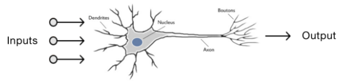
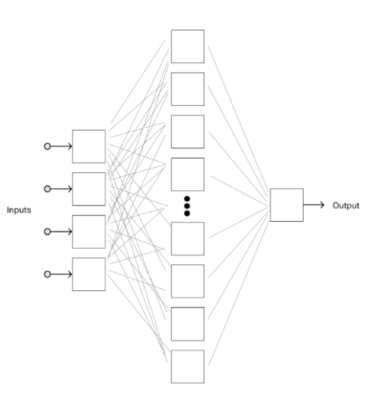

# Flappy-Unicorn :unicorn:
Visit https://flappy-unicorn.github.io/ to see it in Action!

## NEAT and Genetic Algorithms 
Trained an agent to play effectively in a simulation of a simple game. The agent's neural network evolves overtime making it better at the game. 

## Synaptic Library
https://github.com/cazala/synaptic

## Q Learning
The purpose of Q-Learning is to learn a policy, which tells an agent what action to take under what circumstances. It does not require a model of the environment and can handle problems with several changes, as long as it has rewards.

## A Program That Can Learn
To make a program that can learn I’m going to use a neural network.
Neural networks are a technique for building computer programs that is loosely based on the way we think the human brain works. You start with a collection of software neurons. Each neuron in a brain has a bunch of inputs and one output. When enough electrical signals arrive at the inputs, the neuron will activate and send a signal out of the output.

As in a brain, the intelligence in a neural network comes from how these neurons are connected together. This is the neural network example for a game like this.

